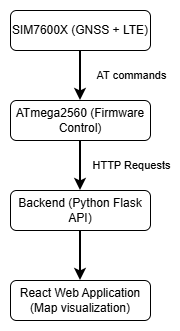
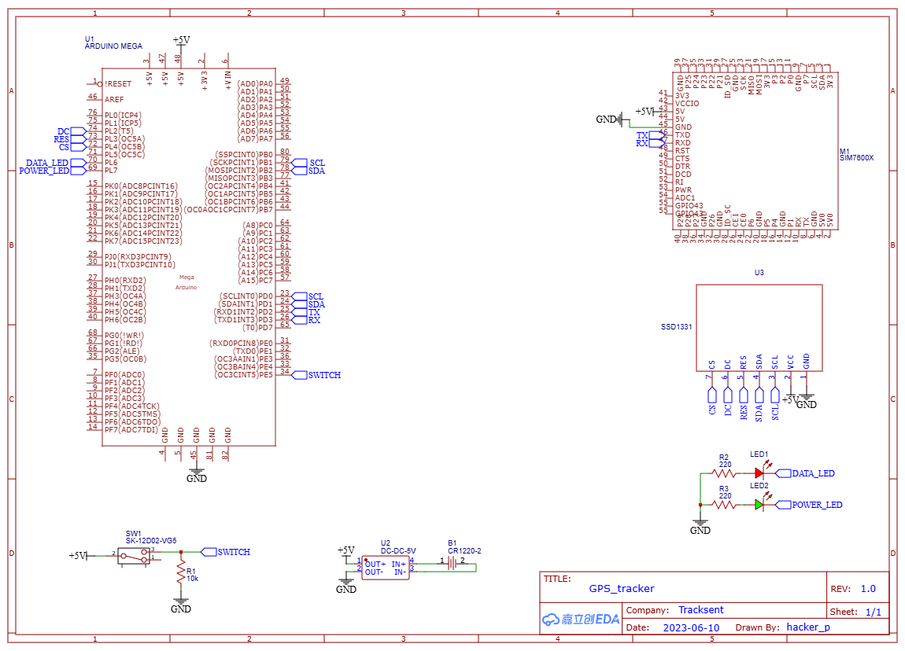

# LTE GPS Tracking System

## Overview

Embedded GPS tracking device designed for real-time vehicle position monitoring.

The system acquires GNSS coordinates using SIM7600E LTE module and transmits location data to a remote backend server via HTTP over cellular network.

The solution includes:

- Embedded firmware (ATmega2560 + SIM7600E)
- Backend server (Python + Flask)
- Web interface (React) for route visualization

## System Architecture



## Hardware

### Microcontroller

- ATmega2560 (Arduino Mega)

### LTE + GNSS Module

- SIM7600X
- GNSS coordinate acquisition
- LTE data transmission (HTTP over cellular network)

### Display

- SSD1331 graphical OLED display

### User Input

- Physical toggle switch (start/stop data transmission)



## Firmware Design

### 1. Initialization Phase

On power-up the firmware:

- Verifies modem availability via AT commands
- Initializes LTE stack
- Enables GNSS engine
- Configures HTTP parameters
- Waits for GNSS fix (may take up to ~60 seconds)

Device states displayed on OLED:

- Initialization
- Ready
- Sending
- Error

This provides clear runtime diagnostics.

### 2. GNSS Data Acquisition

Coordinates are obtained using:
```
AT+CGPSINFO
```

Firmware parses NMEA-style response and extracts:

- Latitude
- Longitude
- UTC time

Typical positioning accuracy inside vehicle:
~2–4 meters

### 3. HTTP Data Transmission

Location data transmitted via LTE using AT HTTP commands:
```
AT+HTTPPARA="URL","https://..."
```

Process:

1. Configure URL
2. Prepare payload (coordinates + route ID)
3. Trigger HTTP request
4. Handle modem response codes

Transmission occurs only when hardware switch is enabled.

### 4. Route Management Logic

On device startup:

- Firmware sends request to backend to create new route entry
- Backend returns route ID
- Subsequent coordinate points linked to this route

This ensures structured trip segmentation in database.

## Backend

### Technology Stack

- Python
- Flask
- REST API
- SQLite database (routes + coordinate points)

### Responsibilities:

- Create new route on device startup
- Accept coordinate POST requests
- Store trip data
- Provide API for frontend visualization

## Frontend

### Technology Stack

- React
- Google maps api

### Features:

- Route selection
- Real-time / historical trip visualization
- Display of path based on stored coordinates

## Embedded Concepts Used

- AT command-based modem control
- LTE HTTP communication
- GNSS coordinate parsing
- Finite state machine for device states
- Serial communication handling (UART)
- External hardware-triggered transmission control
- End-to-end IoT system integration

## Lessons Learned

- Cellular modem initialization complexity
- GNSS fix acquisition timing variability
- Importance of response validation for AT commands
- Real-world LTE communication latency handling
- Designing embedded firmware to interact with cloud services